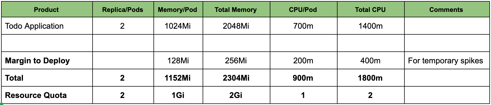

# Cloud-Native Application Resource Estimation
As a developer or an Architect, one of the very first decisions you need to make when deploying an application to the cloud (whether public, private or on-prem) is to determine how much resources the application needs. Teams get their applications to production before they realize the resources are either under or over estimated which often leads to fire fighting in Production environment. Most the operational challenges faced in production are as a result of the fact that this process is often overlooked. 

The benefits of properly estimating the resources an application needs before getting to production among others are:

1. It helps in understanding application requirements in terms of how much memory and CPU the application needs
2. It help to understand wehther an application is more memory intensive or CPU intesive.
3. It simplifies carving of resources on Openshift/Kubernetes which in turn simplifies the creation of qotas and limits for the application namespace.
4. It allows capacity planning from oeprations perpective, for instance, a cluster administrator can easily determine how many worker nodes in the cluster.
5. It leads to huge cost savings especially if your kubernetes cluster is in the public cloud infrastructure.

Estimating the resources an application need is very challenging to be honest because it involves some trial and error. Identifying accurately how many resources a container for instance will require, and how many replicas a service will need at a given time to meet service-level agreements takes time and effort, hence the process is more of an art than science. You’ll first want to identify what a good starting point is for the application; aiming for a good balance of CPU and memory. After you’ve decided on a sensible resource size for the application you will also need to setup a process where you can constantly monitor the application's resource actual usage over a period of time. 

In this workshop, we'll be walking you through the process of properly estimating your application resources, in terms of memory and CPU. At the end, we will come up with figure 1, which can be used to create the resource quota for the appplication namespace.


*Figure 1*

## Definitions
Before we dive into codes, let's define some concepts.

### Compute Resource Types
Compute resources are measurable quantities that can be requested, allocated, and consumed. These are diffirent from API resources such as Pods, Services, Routes etc that are accessible and modified through the Kubernetes/Openshift API server. 

There are two types of Compute resources:
1. **Compressible resources**: these are resources that are technically available in limited quality in a given time slice, however, there is an unlimited amount of them if you can wait. Examples of this type of resource are CPU, block i/o, and network i/o. With respect to application resource estimation, we will focus on CPU. Once an application hits the CPU limits allocated, the application start throttling, which adversely leads to performance degradation. Openshift/Kubernetes will not terminate those applications.

2. **Incompressible resources**: these are resources that aare technically limited, once you run out of them, you application will not get any more. Examples of such is are memory and disk space. Unlike CPU, memory can't be made to run slower. Instead, Openshif/Kubernetes automatically restarts or terminates the applications once it reaches the memory limit.

An Architect therefore needs to put these behaviours into consideration during application resource planning to avoid any issues in production.

### Resource Units
1. **CPU:** - CPU resources are measured in millicore. If a node has 2 cores, the node’s CPU capacity would be represented as 2000m. The unit suffix m stands for “thousandth of a core.”

2. **Memory**: Memory on the other hand is measured in bytes. However, you can express memory with various suffixes (E,P,T,G,M,K and Ei, Pi, Ti, Gi, Mi, Ki) to express mebibytes (Mi) to petabytes (Pi). Most simply use Mi.

``` yaml
...
spec:
    containers:
    - image: quay.io/ooteniya/todo-spring:v1.3.6
        imagePullPolicy: Always
        name: todo-spring
        resources:
        limits:
            memory: "512Mi"
            cpu: "60m"  
        requests:
            memory: "128Mi"
            cpu: "30m"
...
```

>Here's an example of a Container that has a request of 30m cpu and 128MiB of memory. The Container has a limit of 60m cpu and 512MiB of memory.

### Resource Quotas

A [resource quota](https://docs.openshift.com/container-platform/4.7/applications/quotas/quotas-setting-per-project.html#quotas-resources-managed_quotas-setting-per-project), provides constraints that limit aggregate resource consumption per project. It can limit the quantity of objects that can be created in a project by type, as well as the total amount of compute resources and storage that might be consumed by resources in that project. It is defined by a `ResourceQuota` object.

Below snippet defines a resource quota object on cpu and memory.

```yaml
apiVersion: v1
kind: ResourceQuota
metadata:
  name: compute-resources
spec:
  hard:
    pods: "4" 
    requests.cpu: "1" 
    requests.memory: 1Gi 
    requests.ephemeral-storage: 2Gi 
    limits.cpu: "2" 
    limits.memory: 2Gi 
    limits.ephemeral-storage: 4Gi 
```
> This is usually defined to limit how many resources a single tenant in a multitenant environment can request so that they don't take over the cluster. This is evaluated at Request Time.

### Request and Limits


```yaml
...
containers:
    - image: quay.io/ooteniya/todo-spring:v1.3.6
        imagePullPolicy: Always
        name: todo-spring
        resources:
        limits:
            memory: "512Mi"
            cpu: "60m"  
        requests:
            memory: "128Mi"
            cpu: "30m"
...
```
> Requests are evaluated at Scheduling Time and it's counted towards the quota. Limits in turn are evaluated at Run Time and it's not counted towards the quata.

### Limit Range
A [limit range](https://docs.openshift.com/container-platform/4.7/nodes/clusters/nodes-cluster-limit-ranges.html) restricts resource consumption in a project. In the project you can set specific resource limits for a pod, container, image, image stream, or persistent volume claim (PVC). It is defined by a `LimitRange` object.

```yaml
apiVersion: "v1"
kind: "LimitRange"
metadata:
  name: "resource-limits"
spec:
  limits:
    - type: "Container"
      max:
        cpu: "2"
        memory: "1Gi"
      min:
        cpu: "100m"
        memory: "4Mi"
      default:
        cpu: "300m"
        memory: "200Mi"
      defaultRequest:
        cpu: "200m"
        memory: "100Mi"
      maxLimitRequestRatio:
        cpu: "10"
```


> When Request and Limit are not set for a container, whatever is defined by the administrator for the namespace is used as the default. It is strongly recommended that application Architects and developers should always specify resource request and limits for their pods.

### Quality of Service (QoS)
In an overcommitted environment, i.e a situation where scheduled pod has no request, or the sum of limits across all pods on that node exceeds available machine capacity, the node must give priority to one pod over another. The mechanism that is used to determine which pod to prioritize is known as [Quality of Service (QoS)](https://docs.openshift.com/container-platform/4.7/nodes/clusters/nodes-cluster-overcommit.html#nodes-cluster-overcommit-qos-about_nodes-cluster-overcommit) Class.

There are three classes:
1. A **BestEffort** quality of service is provided when a request and limit are not specified.
2. A **Burstable** quality of service is provided when a request is specified that is less than an optionally specified limit
3. A **Guaranteed** quality of service is provided when a limit is specified that is equal to an optionally specified request.

In terms of priority, the Guaranteed, Burstable and BestEffort have priority 1 (highest), priority 2 and priority 3 (lowest) respectively.

### Application Estimation: Well-estimation, Over-estimation and Under-estimation
X

### Resource Estimation Approach

#### Performance Tuning Good Practice
#### Load Testing

### Scaling

## Good Practice

## Prerequisites
1. Access to Openshiuft Cluster
2. Install Openshift Pipeline Operator
3. Install a Postgressql database for the To-do application
4. Access to an external image registry (we use https://quay.io for this workshop)
5. Create a secret for pulling images from the image registry
6. Add the secret to Openshift pipeline serviceaccount
7. Download Apache JMeter for Performance testing

## Objective of the test
1. Check the response times of a web application, according to the number of virtual users
2. Test the limits of an application (the number of users the application can accommodate before it crashes)

1. Describe the application to profile
2. Describe the deployment process
3. Startup JMeter
4. Record your test cases
5. Configure your firefox to listen to actions
6. Setup thread group to simulate users
7. Configure your graphs
8. Load test the applications

## Preparation:
1. Deploy the application using spring boot with appropriate tags
2. Show the CICD pipeline code and on Openshift
3. Show the pipeline working during the build
4. Show the application deployed with one replica
5. Open the application endpoint from a Developer perspective
6. Show the metrics, health, OpenAPI, and Swagger UI
7. Show the endpoints to profile in SwaggerUI
8. Start test Plan Recording (Firefox browser and JMeter Recording)
### Define metrics: 
Throughput=min 2000 tps
Error rate=0.04%
Concurrent users=1000/sec
Peak Period User=4000/sec within 1 min windows
Black Friday Peak Period User=5000/sec within 3 min windows
Switch to the Prepared Test cases for Normal and Peak Period and walkthrough


## Resource Estimation

Check the start-up time. This is important for scaling in peak periods
Adjust to have a fast start-up time initially. 
What is the best resource requirement for the startup time I need? 
Not applicable to every use case
What’s my breakpoint with one pod - Note the resource usage. 
Does the breakpoint lower than my desired metrics? 
How many replicas do I need to start with for the desired metrics?
What’s the resource required to achieve the desired throughput with a normal workload? (You need to run this for a period of time say 1 day to 1 week)
What’s the resource requirement to cope with spikes and Black Friday requests?
Estimate the resource usage per pod/container
Use that to determine your quota


Run JMeter from Command line
## Normal load CLI command
./apache-jmeter-5.4.1/bin/jmeter.sh -n -t Todo-ThreadGroup_OCP_NORMAL.jmx -l result.txt -e -o ./report

## Peak load CLI command
./apache-jmeter-5.4.1/bin/jmeter.sh -n -t Todo-ThreadGroup_OCP_PEAK.jmx -l result.txt -e -o ./report

## References

1. [11 Simple Java Performance Tuning Tips – Stackify](https://stackify.com/java-performance-tuning/)
2. [Best Website Performance Testing Tools – Stackify](https://stackify.com/best-website-performance-testing-tools/)
3. [How Full is My Cluster - Part 3: Capacity Management](https://www.openshift.com/blog/full-cluster-part-3-capacity-management)
4. [O'reilly Kubernetes Best Practices](https://learning.oreilly.com/library/view/kubernetes-best-practices/9781492056461/ch08.html)

## Credits
1. [Eric Deandrea](https://github.com/edeandrea)  for the original [Todo-spring-quarkus](https://github.com/edeandrea/todo-spring-quarkus) application.
2. 