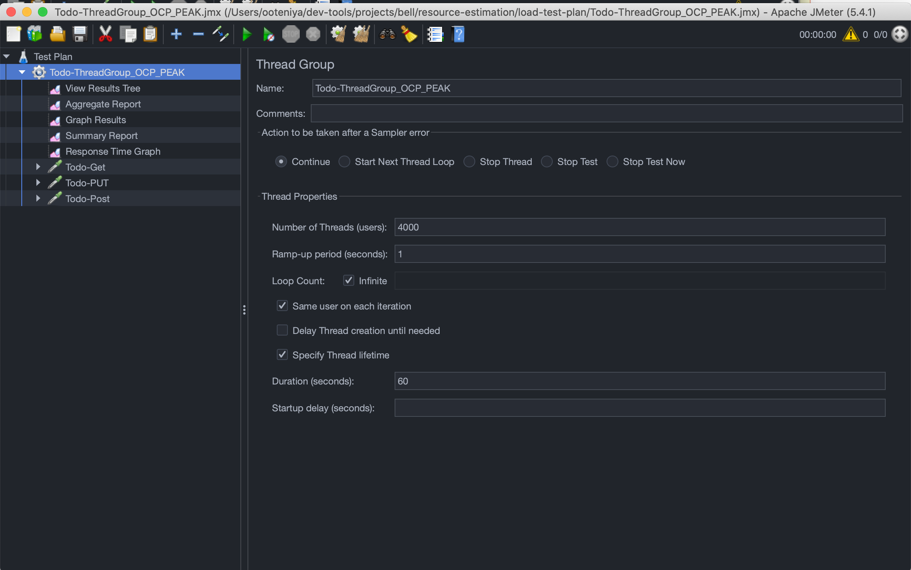

Table of Contents
=================

   * [Table of Contents](#table-of-contents)
   * [Cloud-Native Application Resource Estimation - Part 1: Concepts](#cloud-native-application-resource-estimation---part-1-concepts)
      * [Definitions](#definitions)
         * [Compute Resource Types](#compute-resource-types)
         * [Resource Units](#resource-units)
         * [Resource Quotas](#resource-quotas)
         * [Request and Limits](#request-and-limits)
         * [Limit Range](#limit-range)
         * [Quality of Service (QoS)](#quality-of-service-qos)
         * [Resource Estimation: Well-estimation, Over-estimation and Under-estimation](#resource-estimation-well-estimation-over-estimation-and-under-estimation)
      * [Resource Estimation Approach](#resource-estimation-approach)
         * [Performance Tuning Good Practice](#performance-tuning-good-practice)
         * [Load Testing](#load-testing)
         * [Scaling](#scaling)
      * [Conclusion](#conclusion)
      * [References](#references)
      * [Credits](#credits)
   * [Cloud-Native Application Resource Estimation - Part 2: Process](#cloud-native-application-resource-estimation---part-2-process)
      * [Resource Estimation Setup](#resource-estimation-setup)
         * [Pre-requisites](#pre-requisites)
         * [Environment Setup](#environment-setup)
      * [Resource Estimation Process](#resource-estimation-process)
         * [Todo Application Deployment and Tools Setup](#todo-application-deployment-and-tools-setup)
            * [Install and deploy the Todo-spring Application](#install-and-deploy-the-todo-spring-application)
            * [Apply a VPA custome resource to monitor the application's resource usage](#apply-a-vpa-custome-resource-to-monitor-the-applications-resource-usage)
            * [Record Test Plans using Apache JMeter](#record-test-plans-using-apache-jmeter)
         * [Designing the Load Testing Plan](#designing-the-load-testing-plan)
         * [Test Script Execution, Performance and Resource Monitoring](#test-script-execution-performance-and-resource-monitoring)
            * [Step 1: Determine the right resources to achieve the required startup time](#step-1-determine-the-right-resources-to-achieve-the-required-startup-time)
            * [Step 2: Determine the application breakpoint.](#step-2-determine-the-application-breakpoint)
      * [Normal load CLI command](#normal-load-cli-command)
      * [Peak load CLI command](#peak-load-cli-command)

# Cloud-Native Application Resource Estimation - Part 1: Concepts
As a developer or an Architect, one of the very first decisions you need to make when deploying an application to the cloud (whether public, private or on-prem) is to determine how much resources the application needs. Teams get their applications to production before they realize the resources are either under or over estimated, which often leads to fire fighting in production environment. Most the operational challenges faced in production are as a result of the fact that this process is often overlooked. 

The benefits of properly estimating the resources an application needs before getting to production among others are:

1. It helps in understanding application requirements in terms of how much memory and CPU the application needs
2. It help to understand wehther an application is more memory intensive or CPU intesive.
3. It simplifies carving of resources on Openshift/Kubernetes which in turn simplifies the creation of qotas and limits for the application namespace.
4. It allows capacity planning from oeprations perpective, for instance, a cluster administrator can easily determine how many worker nodes in the cluster.
5. It leads to huge cost savings especially if your kubernetes cluster is in the public cloud infrastructure.

Estimating the resources an application need is very challenging to be honest because it involves some trial and error. Identifying accurately how many resources a container for instance will require, and how many replicas a service will need at a given time to meet service-level agreements takes time and effort, hence the process is more of an art than science. You’ll first want to identify what a good starting point is for the application; aiming for a good balance of CPU and memory. After you’ve decided on a sensible resource size for the application you will also need to setup a process where you can constantly monitor the application's resource actual usage over a period of time. 

In this workshop, we'll be walking you through the process of properly estimating your application resources, in terms of memory and CPU. At the end, we will come up with figure 1, which can be used to create the resource quota for the appplication namespace.


*Figure 1*

## Definitions
Before we dive into codes, let's define some concepts.

### Compute Resource Types
Compute resources are measurable quantities that can be requested, allocated, and consumed. These are diffirent from API resources such as Pods, Services, Routes etc that are accessible and modified through the Kubernetes/Openshift API server. 

There are two types of Compute resources:
1. **Compressible resources**: these are resources that are technically available in limited quality in a given time slice, however, there is an unlimited amount of them if you can wait. Examples of this type of resource are CPU, block i/o, and network i/o. With respect to application resource estimation, we will focus on CPU. Once an application hits the CPU limits allocated, the application start throttling, which adversely leads to performance degradation. Openshift/Kubernetes will not terminate those applications.

2. **Incompressible resources**: these are resources that aare technically limited, once you run out of them, you application will not get any more. Examples of such is are memory and disk space. Unlike CPU, memory can't be made to run slower. Instead, Openshif/Kubernetes automatically restarts or terminates the applications once it reaches the memory limit.

An Architect therefore needs to put these behaviours into consideration during application resource planning to avoid any issues in production.

### Resource Units
1. **CPU:** - CPU resources are measured in millicore. If a node has 2 cores, the node’s CPU capacity would be represented as 2000m. The unit suffix m stands for “thousandth of a core.”

2. **Memory**: Memory on the other hand is measured in bytes. However, you can express memory with various suffixes (E,P,T,G,M,K and Ei, Pi, Ti, Gi, Mi, Ki) to express mebibytes (Mi) to petabytes (Pi). Most simply use Mi.

``` yaml
...
spec:
    containers:
    - image: quay.io/ooteniya/todo-spring:v1.3.6
        imagePullPolicy: Always
        name: todo-spring
        resources:
        limits:
            memory: "512Mi"
            cpu: "60m"  
        requests:
            memory: "128Mi"
            cpu: "30m"
...
```

>Here's an example of a Container that has a request of 30m cpu and 128MiB of memory. The Container has a limit of 60m cpu and 512MiB of memory.

### Resource Quotas

A [resource quota](https://docs.openshift.com/container-platform/4.7/applications/quotas/quotas-setting-per-project.html#quotas-resources-managed_quotas-setting-per-project), provides constraints that limit aggregate resource consumption per project. It can limit the quantity of objects that can be created in a project by type, as well as the total amount of compute resources and storage that might be consumed by resources in that project. It is defined by a `ResourceQuota` object.

Below snippet defines a resource quota object on cpu and memory.

```yaml
apiVersion: v1
kind: ResourceQuota
metadata:
  name: compute-resources
spec:
  hard:
    pods: "4" 
    requests.cpu: "1" 
    requests.memory: 1Gi 
    requests.ephemeral-storage: 2Gi 
    limits.cpu: "2" 
    limits.memory: 2Gi 
    limits.ephemeral-storage: 4Gi 
```
> This is usually defined to limit how many resources a single tenant in a multitenant environment can request so that they don't take over the cluster. This is evaluated at Request Time.

### Request and Limits


```yaml
...
containers:
    - image: quay.io/ooteniya/todo-spring:v1.3.6
        imagePullPolicy: Always
        name: todo-spring
        resources:
        limits:
            memory: "512Mi"
            cpu: "60m"  
        requests:
            memory: "128Mi"
            cpu: "30m"
...
```
> Requests are evaluated at Scheduling Time and it's counted towards the quota. Limits in turn are evaluated at Run Time and it's not counted towards the quota.

### Limit Range
A [limit range](https://docs.openshift.com/container-platform/4.7/nodes/clusters/nodes-cluster-limit-ranges.html) restricts resource consumption in a project. In the project you can set specific resource limits for a pod, container, image, image stream, or persistent volume claim (PVC). It is defined by a `LimitRange` object.

```yaml
apiVersion: "v1"
kind: "LimitRange"
metadata:
  name: "resource-limits"
spec:
  limits:
    - type: "Container"
      max:
        cpu: "2"
        memory: "1Gi"
      min:
        cpu: "100m"
        memory: "4Mi"
      default:
        cpu: "300m"
        memory: "200Mi"
      defaultRequest:
        cpu: "200m"
        memory: "100Mi"
      maxLimitRequestRatio:
        cpu: "10"
```


> When Request and Limit are not set for a container, whatever is defined by the administrator for the namespace is used as the default. It is strongly recommended that application Architects and developers should always specify resource request and limits for their pods.

### Quality of Service (QoS)
In an overcommitted environment, i.e a situation where scheduled pod has no request, or the sum of limits across all pods on that node exceeds available machine capacity, the node must give priority to one pod over another. The mechanism that is used to determine which pod to prioritize is known as [Quality of Service (QoS)](https://docs.openshift.com/container-platform/4.7/nodes/clusters/nodes-cluster-overcommit.html#nodes-cluster-overcommit-qos-about_nodes-cluster-overcommit) Class.

There are three classes:
1. A **BestEffort** quality of service is provided when a request and limit are not specified.
2. A **Burstable** quality of service is provided when a request is specified that is less than an optionally specified limit
3. A **Guaranteed** quality of service is provided when a limit is specified that is equal to an optionally specified request.


*QoS behavior with respect to CPU*

In terms of priority, the Guaranteed, Burstable and BestEffort have priority 1 (highest), priority 2 and priority 3 (lowest) respectively.


*QoS behavior with respect to Memory*

### Resource Estimation: Well-estimation, Over-estimation and Under-estimation
As mentioned, the request set on a pod is counted towards the quota. To determine whether an application is well estimated, under estimated or over estimated depends on the comparison between the resource requests and the actual resource consumption.

Generally, a certain threshold is set above and below the request to determine how an application is performing resource-wise. Let's assume a threshold of certain percentage, say 20% of the request is set above and below the request. A well estimated application resource usage stays above the overestimated threshold and below the underestimated threshold. If the actual usage of the resource is below the overestimated threshold, the application is considered Overestimated. If the actual usage is above the underestimated threshold, it is considered underestimated. [Raffaele Spazzoli](https://www.openshift.com/blog/full-cluster-part-3-capacity-management) wrote a very nice article about this.

## Resource Estimation Approach
Now that we have a very good understanding of some concepts that Openshift/Kunbernetes uses to determine an application resources and how they are scheduled, let's discuss the approach to use to proeprly estimate an application's resource requirments.


*Compute Resource Estimation Approach*

### Performance Tuning Good Practice

1. Don’t optimize before you know it’s necessary - You need to define how fast your application code has to be, for example, by specifying a maximum response time for all API calls or the number of records that you want to import within a specified time frame. Measure which parts of your application are too slow and need to be improved.

2. Use a profiler to find the real bottleneck - There are two ways of doing this. It's either you can take a look at your code and start with the part that looks suspicious or where you feel that it might create problems or you use a profiler and get detailed information about the behavior and performance of each part of your code.
The profiler-based method gives you a better understanding of the performance implications of your code and allows you to focus on the most critical parts.

3. Use lightweight frameworks and avoid the overhead of heavy application servers - Use lightweight frameworks and avoid the overhead of heavy application servers if possible. Use frameworks that are based for instance, on microprofiles instead of a heavy JEE Compliant application servers.

4. Create a performance test suite for the whole application - It's important to work on the perform performance or load test on an application to determine the breaking point of the application etc. Based on the result of the test, work on the most significant performance problem first.


5. Work on the biggest bottleneck first - It might be tempting to start with the quick wins because you will be able to show first results soon. Sometimes, that might be necessary to convince other team members or your management that the performance analysis was worth the effort. But in general, I recommend starting at the top and begin work on the most significant performance problem first.

6. Use Efficient Serialization Techniques - Use efficient serialization formats like protocol buffers, commonly used in gRPC. Another areas to consider for example is, if you have a request with a large message payload and operates on only a handful of fields in a large message payload, before passing it to a downstream service, put those fields into headers so the service does not need to deserialize or reserialize the payload. 

### Load Testing
Load testing will identify the following:
1. maximum operating capacity
2. the ability of an application to run in the actual environment
3. sustainability of the application during peak user load
4. maximum concurrent users the application can support

Perform application load testing to determine the right amount of memory and CPU for an application to function properly at all times. There are several tools such as [WedLoad](https://www.radview.com/webload-download?utm_campaign=top-15-tools&utm_medium=top-15-tools&utm_source=softwaretestinghelp), [Apache JMeter](https://jmeter.apache.org/), [LoadNinja](https://loadninja.com/), [Smart Meter](https://www.smartmeter.io/), [k6](https://k6.io/), [Locust](https://locust.io/) etc. available to aid this process.


### Scaling
Openshift/Kubernetes scaling capabilities provide a mechanism to dynamically adjust to user worloads. Scaling can be manual or automatic. For workloads that are static or when you have insight into when an application experience spikes, manual scaling can be used to provide optimal configuration to match the workload. Also it's provides an avenue to discover and apply the optimal configuration to handle the workload. This can be done imperatively using the `oc` or `kubectl` commands. Alternatively, it could aldo be done declaratively on the deployment or deploymentConfig objects of the application.

For worloads that experience sudden spikes, automatic scaling is the most ideal as you can not readily predict the spike periods.

Scaling can be [Horizontal](https://docs.openshift.com/container-platform/4.7/nodes/pods/nodes-pods-autoscaling.html) i.e changing the replica of a pod, or [Veritcal](https://docs.openshift.com/container-platform/4.7/nodes/pods/nodes-pods-vertical-autoscaler.html), changing the resource constraints of he containers in the pod.

## Conclusion
In summary, it is important to follow the recommendation below to arrive at a very good application resource estimate:

1. Perform load testing

2. Ensure that you set memory and CPU for all pods.

3. Start with manual scaling until you understand your application profile on Openshift.

4. Use VPA in Development to determine your application resource usage.
 
5. Use the HPA for workloads that are variable and that have unexpected spikes in their usage.

## References

1. [11 Simple Java Performance Tuning Tips – Stackify](https://stackify.com/java-performance-tuning/)
2. [Best Website Performance Testing Tools – Stackify](https://stackify.com/best-website-performance-testing-tools/)
3. [How Full is My Cluster - Part 3: Capacity Management](https://www.openshift.com/blog/full-cluster-part-3-capacity-management)
4. [O'reilly Kubernetes Best Practices](https://learning.oreilly.com/library/view/kubernetes-best-practices/9781492056461/ch08.html)

## Credits
1. [Eric Deandrea](https://github.com/edeandrea)  for the original [Todo-spring-quarkus](https://github.com/edeandrea/todo-spring-quarkus) application.
2. Ed Seymour for the QoS and Limit Range diagrams 

# Cloud-Native Application Resource Estimation - Part 2: Process
In the first first part of this article, we touched on the concepts and approach of Application resource estimation. In this secoind part, we will be walking you through a pratical example of Application resource estimation.

## Resource Estimation Setup
In this workshop, we will be determining the resource requirement of a [Todo-spring-quakus](https://github.com/ooteniya1/resource-estimation) application which was originally setup by [Eric Deandrea](https://github.com/edeandrea) but customized to fit the purpose of this workshop.

The Architecture diagram below highlights the key components we will be using for the estimation process.


### Pre-requisites
For this workshop, you will need the following:

1. Access to Openshift Cluster
2. Install Openshift Pipeline Operator
3. Install a Postgressql database for the To-do application
4. Install Vertical Pod Autoscaler Operator
5. Access to an external image registry (we use https://quay.io for this workshop)
6. Create a secret for pulling images from the image registry
7. Create a secret for github
8. Add the registry and github secret to Openshift pipeline serviceaccount
9. Download Apache JMeter for Performance testing
### Environment Setup
We will use a script to setup the environment. You will nee dthe following tools pre-installed when you run the script.

- [Helm](https://helm.sh/docs/intro/install/) : `helm` version
- [Git](https://git-scm.com/book/en/v2/Getting-Started-Installing-Git) : `git` version
- [oc](https://docs.openshift.com/container-platform/4.5/cli_reference/openshift_cli/getting-started-cli.html) : `oc` version
- [kustomize](https://kubernetes-sigs.github.io/kustomize/installation/) v3.1.0 or higher: `customize` version
- [tkn](https://github.com/tektoncd/cli) (optional Tekton CLI): `tkn` version
- envsubst (gettext): `envsubst` --help

To get started, clone or fork the source code repository:

`$ git clone https://github.com/ooteniya1/resource-estimation.git`

Once you have all the enviroment set up, login to your Openshift cluster.

`$ oc login --token=TOKEN --server=https://api.YOUR_CLUSTER_DOMAIN:6443`

Create `resource-estimation` namespace.

`$ oc new-project resource-estimation`

Run the setup scripts to install the Openshift-pipeline, Postgresql and VerticalPodAutoscaler operators.

```
$ cd helm
$ ./setup-prereq.sh

 ```
  
 You should see output similar to below:

``` text
Installing openshift-pipelines operator
Release "openshift-pipelines" has been upgraded. Happy Helming!
NAME: openshift-pipelines
LAST DEPLOYED: Tue Mar 16 20:59:36 2021
NAMESPACE: resource-estimation
STATUS: deployed
REVISION: 1
TEST SUITE: None

Installing postgresql Operator
Release "postgresql" does not exist. Installing it now.
NAME: postgresql
LAST DEPLOYED: Tue Mar 16 20:59:42 2021
NAMESPACE: resource-estimation
STATUS: deployed
REVISION: 1
TEST SUITE: None

Installing vertical pod autoscler
Release "vertical-pod-autoscaler" does not exist. Installing it now.
NAME: vertical-pod-autoscaler
LAST DEPLOYED: Tue Mar 16 20:59:42 2021
NAMESPACE: resource-estimation
STATUS: deployed
REVISION: 1
TEST SUITE: None
```

Now that we have Openshift-pipeline, postresql and vertical pod autoscaler operators installed, let's setup github and quay.io secrets and add it to Openshift-pipeline service account.

```
$ ./add-github-credentials.sh
$ ./add-quay-credentials.sh
```
## Resource Estimation Process

In order to estimate the resource requirements and determine the resource quota to use for the Todo-spring-quarkus namespace, we will going going through the following steps:

1. Define performance goals.
2. Check the start-up time. This is important for scaling in peak periods.
3. Adjust to have a fast start-up time initially. 
   - What is the best resource requirement for the startup time I need? 
   - Not applicable to every use case
4. What’s my breakpoint with one pod - Note the resource usage. 
   - Is the breakpoint lower than my desired metrics? 
   - How many replicas do I need to start with to achieve the desired metrics/performance goals?
5. What’s the resource required to achieve the desired throughput with a normal workload? (You need to run this for a period of time say 1 day to 1 week)
6. What’s the resource requirement to cope with spikes and "Black Friday" requests?
7. Estimate the resource usage per pod/container
8. Use that to determine your quota

### Todo Application Deployment and Tools Setup
Before we go through the proesses outlined above, let's prepare the application and the tools.
#### Install and deploy the Todo-spring Application 

This steps build on the previous setup steps. Make sure the steps below have been successfully completed.

```
$ cd helm
$ ./setup-prereq.sh
$ ./add-github-credentials.sh
$ ./add-quay-credentials.sh

 ```

The Todo Application uses the `tekton-pipeline/todo-pipeline.yaml` to build and deploy the application Openshift. The application can be deployed as a Quarkus or Spring Boot application. We will be using the Spring Boot version.

Before then, let's install the postgresql database the application uses.

```text
$ oc apply -f ../todo-spring-quarkus/k8s/postgresql-instance.yaml
database.postgresql.dev4devs.com/postgresql created
```

Deploy the application 

``` text
$ cd tekton-pipeline
$ ./build-deploy-todo-spring v1.3.8

```
This will build the application, tag the created image as `v1.3.8` , push to https://quay.io and from there deploy to Openshift.


*Openshift pipeline*


*Openshift pipeline - Build Step*


*Todo-spring image repository*


*Openshift pipeline - Deploy Step*


*Todo Application Topology*

If the application is failing readiness check, that's because the application does not have enough processing unit to complete the initialization process. We will talk more about this later. In order to meet the required startup time for the readiness probe, update the `Deployment` as follows:

``` yaml
...
  spec:
      containers:
        - resources:
            limits:
              cpu: 600m
              memory: 512Mi
            requests:
              cpu: 300m
              memory: 128Mi

...
```
The startup time should be fast enough now. 


*Todo Application Page*


*Todo Application Swagger UI*


#### Apply a VPA custome resource to monitor the application's resource usage

[Vertical Pod Autoscaler Operator (VPA)](https://docs.openshift.com/container-platform/4.7/nodes/pods/nodes-pods-vertical-autoscaler.html) automatically reviews the historic and current CPU and memory resources for containers in pods and can update the resource limits and requests based on the usage values it learns. 

>The [VPA](https://docs.openshift.com/container-platform/4.7/nodes/pods/nodes-pods-vertical-autoscaler.html) uses individual custom resources (CR) to update all of the pods associated with a workload object, such as a Deployment, Deployment Config, StatefulSet, Job, DaemonSet, ReplicaSet, or ReplicationController.

>The VPA helps you to understand the optimal CPU and memory usage for your pods and can automatically maintain pod resources through the pod lifecycle.

VPA has three main components:


1. Recommender - Monitors the current and past resource consumption, and provides recommended values for the container’s CPU and memory requests.

2. Updater - Checks which of the pods have the correct resources set, and if they don’t, kills them so that they can be re-created by their controllers with the updated requests.
 
3. Admission Plugin - Sets the correct resource requests on new pods.

`vpa.yaml`

``` yaml
apiVersion: autoscaling.k8s.io/v1
kind: VerticalPodAutoscaler
metadata:
  name: todo-recommender-vpa
spec:
  targetRef:
    apiVersion: "apps/v1"
    kind: Deployment 
    name: todo-spring 
  updatePolicy:
    updateMode: "Off" 
```
   
The VPA recommendations are stored in the `status`. As you can see in `vpa.yaml`, the `updateMode: "Off" ` means no changes to the selected resources are performed based on the recommended values in the status. There are two other types: `updateMode: "Initial" ` and `updateMode: "Auto" `.

**Initial**: means recommendations are applied during creation of a Pod and it influences scheduling decision.
**Auto**: means pods are automatically restarted with the updated resources based on recommendation.

VPA is not currently reccomended for Production deployment but for resources usage estimation, it's a good tool to deploy in the development environment.

Let's create the CR.

```
$ oc apply -f ..//todo-spring-quarkus/k8s/vpa.yaml

verticalpodautoscaler.autoscaling.k8s.io/todo-recommender-vpa created

```

#### Record Test Plans using Apache JMeter
Now that we have the Todo application up and running, the next step is to create our test plans based on the Todo endpoints. For this workshop, the endpoints we would like to profile are:

```
$ curl -X GET "http://todo-spring-resource-estimation.apps.cluster-5a89.sandbox1752.opentlc.com/todo/1" -H  "accept: */*"

$ curl -X PUT "http://todo-spring-resource-estimation.apps.cluster-5a89.sandbox1752.opentlc.com/todo" -H  "accept: */*" -H  "Content-Type: application/json" -d "{\"id\":0,\"title\":\"Test Resource Estimation\",\"completed\":true}" 

$ curl -X POST "http://todo-spring-resource-estimation.apps.cluster-5a89.sandbox1752.opentlc.com/todo" -H  "accept: */*" -H  "Content-Type: application/json" -d "{\"id\":0,\"title\":\"string\",\"completed\":true}"
```

Let's first download and install JMeter.

Download [Apache JMeter](https://jmeter.apache.org/) and extract in a directory. Start the application.

```
$ unzip apache-jmeter-5.4.1.zip
$ cd apache-jmeter-5.4.1
$ ./bin/jmeter.sh

================================================================================
Don't use GUI mode for load testing !, only for Test creation and Test debugging.
For load testing, use CLI Mode (was NON GUI):
   jmeter -n -t [jmx file] -l [results file] -e -o [Path to web report folder]
& increase Java Heap to meet your test requirements:
   Modify current env variable HEAP="-Xms1g -Xmx1g -XX:MaxMetaspaceSize=256m" in the jmeter batch file
Check : https://jmeter.apache.org/usermanual/best-practices.html
================================================================================

```

*Apache JMeter GUI*


### Designing the Load Testing Plan

The first step in design a lod testing plan is to understand the performance goal/target opf the system under test from business perspectives.

For our Todo application, we have the following performance requirements that the application must meet.

1. **Throughput**: must be able to process minimum 1000 transactions/sec
2. **Error rate**: 0.04% error rate, which means the application must perform at minimum of 99.96%
3. **Boot-up time**: relatively fast boot time <= 40sec. This is neccessary in case there is a need for scaling.
4. **Concurrent users**: minimum of 1000 users or requests/sec
5. **Peak Period Users**: minimum of 4000 users or requests/sec within 1 min windows
6. **Black Friday Peak Period User**: minimum of 5000 users or requests/sec within 3 min windows

One of the ways of setting up your test script is using the Test Script Recorder. See the [step-by-step guide](https://jmeter.apache.org/usermanual/jmeter_proxy_step_by_step.html) for more information.

Once you have the test scripts that mimiks the type of user interaction you would like to perform, next is to configure the [Thread Group](https://jmeter.apache.org/usermanual/component_reference.html#Thread_Group) which defines a pool of virtual users that will execute the test case against the system. See the [Elements of a Test Plan]( https://jmeter.apache.org/usermanual/test_plan.html) for more information.

We have designed three test scripts to execute on the Todo application:

1. **Normal Load** - at any give point in time, there will be 1000 concurrent users on the system per sec. For the pupose of this workshop, the normal load will be run for 1 hour and then we monitor the performance and the ability of our configuration to handle such requests.


*Normal Load Test Script*

2. **Peak Load** - For a peak load, we expect 4000 concurrent users to be on the system for several cycles within a second for a total during of 1 minute. This is in addition to the 1000 concurrent users on the system per sec in a normal load, making a total of 5000 concurrent users/sec.


*Peak Load Test Script*

3. **Abnormal Load** - For an abnormal load, we expect 5000 concurrent users to be on the system for several cycles within a second for a total during of 3 minutes. This is in addition to the 1000 concurrent users on the system per sec in a normal load, making a total of 6000 concurrent users/sec.


*Abnormal Load Test Script*

### Test Script Execution, Performance and Resource Monitoring

To execute the designed Test scripts, we will be using the Apache JMeter CLI. This is a recommended approach for running a load test as it avoids the overhead of the JMeter GUI. The CLI also generates a bunch of reports we can use to analyze the performance of the application. The main benefit of the CLI over the GUI for load testing is that it consumes fewer resources and gives more reliable results than the GUI. 

>JMeter GUI should only be used to create, maintain, and validate our scripts.  Once the script is validated, use the CLI to run the load test.

[Openshift Monitoring](https://docs.openshift.com/container-platform/4.7/monitoring/understanding-the-monitoring-stack.html) and the installed [VPA](https://docs.openshift.com/container-platform/4.7/nodes/pods/nodes-pods-vertical-autoscaler.html) CR will be used to monitor the resource usage.

We will follow the steps below to estimate resources to fulfil our performance requirements.

1. Check the start-up time. This is important for scaling in peak periods.
2. Adjust to have a fast start-up time initially. 
   * What is the best resource requirement for the startup time I need? 
   * Not applicable to every use case
3. What’s my breakpoint with one pod - Note the resource usage. 
   * Is the breakpoint lower than my desired performance goal? 
   * How many replicas do I need to start with to achieve the desired performance goals?
4. What’s the resource required to achieve the desired throughput with a normal workload? (You need to run this for a period of time say 1 day to 1 week)
5. What’s the resource requirement to cope with spikes and "Black Friday" requests?
   * How many pods does the application need to cope effectively?
   * What's the required memory or CPU utilization to scale up?
6. Estimate the resource usage per pod/container.
7. Use that to determine the quota.

#### Step 1: Determine the right resources to achieve the required startup time

We have a start up time requirement of <= 40sec. This is important because during peak periods like "Black Friday", we want to be able to possibly scale by adding more pod replicas to cater for the load. Our current configuration will fail [`Startup probe`](https://docs.openshift.com/container-platform/4.7/applications/application-health.html) because the application will take a long time to initialize. The CPU is throttled based on the current CPU request and limit configurations. 

```yaml
...
spec:
      containers:
        - image: 'quay.io/ooteniya/todo-spring:v1.3.8'
          imagePullPolicy: Always
          name: todo-spring
          resources:
            limits:
              memory: "512Mi"
              cpu: "60m"  
            requests:
              memory: "128Mi"
              cpu: "30m"
          ports:
            - containerPort: 8080
              protocol: TCP
          ...
          startupProbe: 
            httpGet: 
              path: /health
              port: 8080 
            failureThreshold: 3
            periodSeconds: 40 
...            
```

The Pod will be killed and restarted based on its `restartPolicy`


*CrashLoopBackOff*


*Failed Startup Probe*


*Failed Pod*

The solution to this is to bump up the CPU resources required to give it enough processing power to startup at the required less than 40 secs startup target. Below is the new configuration.

```yaml
...
resources:
  limits:
    memory: "512Mi"
    cpu: "240m"  
  requests:
    memory: "128Mi"
    cpu: "200m"
...
```

With a CPU resource request of 200m and 240m (20% of request value) limit, the startup time of 73.902seconds does not meet the startup performance target. The pod will be restarted because it's lower than the startup probe of `


*Startup not up to Target*

 We need to play around with the request and limit (20% of request) to ahieve that target.  

 ```yaml
...
resources:
  limits:
    memory: "512Mi"
    cpu: "480m"  
  requests:
    memory: "128Mi"
    cpu: "400m"
...
```

With this new configuration, we are able to meet the startup target of less than 40sec. 

*Startup Target Met*

> Do not forget to tune the runtime paramaters such as [JVM parameters for Java](https://learning.oreilly.com/library/view/java-performance-2nd/9781492056102/) etc, to achieve the optimal performance.


#### Step 2: Determine the application breakpoint.

Now that we have achieved the required startup time, next is to determine the application's breakpoint with a single pod, with respect to the target throughput.

The purpose of this step is to determine if the application is able to handle a normal load with the current startup configuration. 

To determine the breakpoint, we need to start from to put a normal load on 

| # Virtual Users |  Throughput    | % in error | Max CPU    | Max Memory  | # of Pods |
| --------------- | -------------- | ---------- | ---------- | ----------- | --------- |
|       2000      |     962        |     0      |   480m     |     512Mi   |     1     |


<!-- 
*Apache JMeter Recorder*


*Apache JMeter Cert*


*Firefox Proxy Setting*


*Apache JMeter Recorder Control*


*Apache JMeter Recorder Result* -->

## Normal load CLI command
./apache-jmeter-5.4.1/bin/jmeter.sh -n -t Todo-ThreadGroup_OCP_NORMAL.jmx -l result.txt -e -o ./report

## Peak load CLI command
./apache-jmeter-5.4.1/bin/jmeter.sh -n -t Todo-ThreadGroup_OCP_PEAK.jmx -l result.txt -e -o ./report

$JMETER_HOME/bin/jmeter.sh -n -t Todo-ThreadGroup_OCP_NORMAL.jmx -l result.txt -e -o ./report  
open -a "Google Chrome" file:///Users/ooteniya/dev-tools/projects/bell/load_test/report/index.html